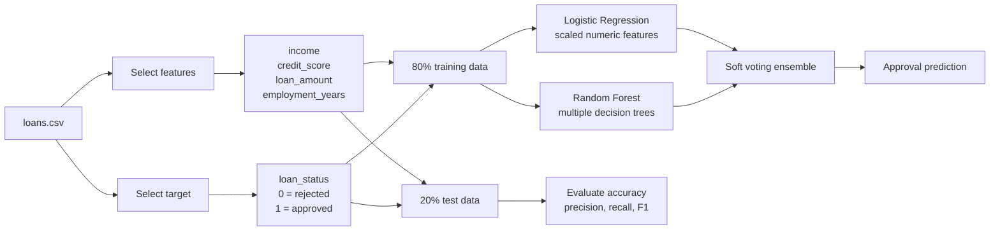

# Loan Approval Model Flow

The two models learn from the same applicant features. Logistic Regression captures a simpler linear relationship, while Random Forest can capture more complex feature interactions. A soft-voting ensemble combines their predicted probabilities before choosing the final class.
