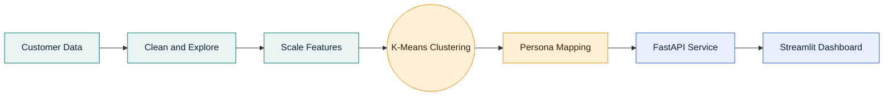
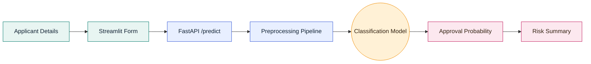

# TNS AIML Data Dudes

<p align="center">
	
</p>

This repository contains two machine learning applications developed by a six-member team. Each project includes data preparation, model development, and a user-facing application.


> Two practical ML products. One collaborative team. Data becomes decisions.

## Projects

### 1. Customer Persona Segmenter

An unsupervised machine learning application that groups customers into meaningful personas based on demographic, financial, and behavioral attributes.

**Technologies:** Python, pandas, scikit-learn, K-Means clustering, FastAPI, and Streamlit.

**Flow:**

```text
Customer Data -> Data Cleaning -> K-Means Model -> Persona Segments -> User Interface
```

Folder: `customer-persona-segmenter/`

### 2. Loan Approval Prediction

A supervised machine learning application that predicts whether a loan application is likely to be approved using income, credit score, loan amount, and employment history.

**Technologies:** Python, pandas, scikit-learn, joblib, FastAPI, and Streamlit.

**Flow:**

```text
Applicant Input -> Streamlit Frontend -> FastAPI Backend -> ML Model -> Approval Prediction
```

Folder: `Loan_Approval_Prediction/`

## Tech Stack

| Layer | Technologies |
| --- | --- |
| Programming language | Python 3.x |
| Data processing | pandas, NumPy |
| Machine learning | scikit-learn |
| Customer segmentation | K-Means clustering, StandardScaler |
| Loan prediction | Logistic Regression, Decision Tree, Random Forest |
| Backend API | FastAPI, Uvicorn, Pydantic |
| Frontend | Streamlit |
| API integration | Requests, REST/JSON |
| Model persistence | Joblib, Pickle |
| Data visualization | Matplotlib, Seaborn |
| Testing | Pytest, FastAPI TestClient |
| Collaboration | Git, GitHub, feature branches, pull requests |

## Project Workflows

<p align="center">
	
</p>

### Customer Persona Segmenter



### Loan Approval Prediction



## Project Structure

```text
TNS_AIML_DATA-DUDES/
├── README.md
├── customer-persona-segmenter/
│   ├── assets/personas/          # Persona images
│   ├── data/
│   │   ├── raw/                  # Original customer data
│   │   └── processed/            # Cleaned customer data
│   ├── models/                   # K-Means and scaler artifacts
│   ├── src/                      # Backend, dataset, and training modules
│   ├── tests/                    # Model tests
│   ├── app_unsupervised.py      # Streamlit application
│   ├── main_unsupervised.py     # FastAPI service
│   ├── dataset_unsupervised.py  # Dataset preparation
│   ├── train_kmeans.py          # K-Means training
│   └── requirements.txt
└── Loan_Approval_Prediction/
	├── backend/
	│   └── main.py              # FastAPI loan prediction API
	├── front-end/
	│   ├── app.py               # Streamlit application
	│   └── assets/               # Approved/rejected images
	├── data/                     # Loan dataset
	├── graphs/                   # Evaluation charts and metrics
	├── models/                   # Trained loan models
	├── reports/                  # Evaluation and analysis reports
	├── scripts/                  # Training and analysis scripts
	└── requirements.txt
```

## Team Roles

The work is divided among six team members, with three members assigned to each project.

### Customer Persona Segmenter Team

#### Member 1 - Data and Machine Learning Engineer

- Clean and analyze customer data
- Prepare features for clustering
- Train and evaluate the K-Means model
- Save and document the trained model

#### Member 2 - Backend/API Developer

- Build the FastAPI service
- Create persona prediction endpoints
- Validate incoming data
- Integrate and test the clustering model

#### Member 3 - Frontend and Visualization Developer

- Build the Streamlit interface
- Display persona results and charts
- Connect the frontend to the API
- Test the complete user workflow

### Loan Approval Prediction Team

### 🤖 HEYMAALOCHAN - Data and Machine Learning Engineer

- Prepare and analyze loan data
- Perform feature engineering and preprocessing
- Train and compare classification models
- Save the selected model and evaluation reports

#### Member 5 - Backend/API Developer

- Build the FastAPI loan approval service
- Create `/health` and `/predict` endpoints
- Validate loan application requests
- Load and test the trained model

#### Member 6 - Frontend and Integration Developer

- Build the Streamlit loan application interface
- Create input forms and result views
- Connect Streamlit to the FastAPI backend
- Display approval probability and risk factors

Replace `Member 1` through `Member 6` with the team members' names.

## Collaboration

Team members should work on separate feature branches, commit focused changes, and merge their work into `main` through pull requests.

```text
main
├── feature/customer-persona-ml
├── feature/customer-persona-backend
├── feature/customer-persona-frontend
├── feature/loan-approval-ml
├── feature/loan-approval-backend
└── feature/loan-approval-frontend
```
